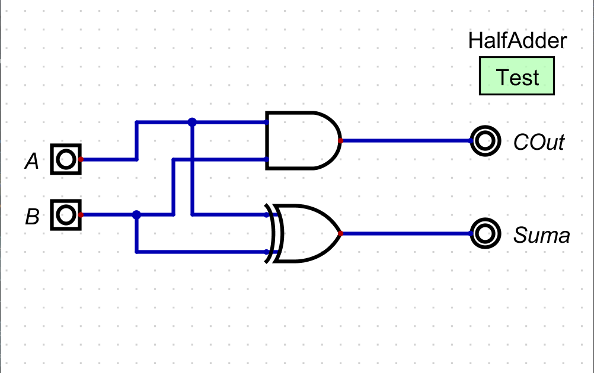

# Laboratorio II

Implementación de un sumador/restador de 4 bits en Verilog.

## Contenido

- [Diseño e Implementación de un medio sumador](#diseño-e-implementación-de-un-medio-sumador)
  - [Tabla de verdad medio sumador](#tabla-de-verdad-medio-sumador)
  - [Mapa de Karnaugh medio sumador](#mapa-de-karnaugh-medio-sumador)
  - [Ecuaciones lógicas medio sumador](#ecuaciones-lógicas-medio-sumador)
  - [Esquema de conexiones (RTL) medio sumador](#esquema-de-conexiones-rtl-medio-sumador)
- [Diseño e Implementación de un sumador completo](#diseño-e-implementación-de-un-sumador-completo)
  - [Tabla de verdad sumador completo](#tabla-de-verdad-sumador-completo)
  - [Mapa de Karnaugh sumador completo](#mapa-de-karnaugh-sumador-completo)
  - [Ecuaciones lógicas sumador completo](#ecuaciones-lógicas-sumador-completo)
  - [Esquema de conexiones (RTL) sumador completo](#esquema-de-conexiones-rtl-sumador-completo)
- [Sumador de 4 bits](#sumador-de-4-bits)
- [Restador](#restador)
  - [Implementación de complemento a 1](#implementación-de-complemento-a-1)
  - [Implementación de complemento a 2](#implementación-de-complemento-a-2)
    - [Tabla de verdad complemento a 2](#tabla-de-verdad-complemento-a-2)
    - [Mapa de Karnaugh complemento a 2](#mapa-de-karnaugh-complemento-a-2)
  - [Implementación del restador](#implementación-del-restador)
- [Implementación en Verilog](#implementación-en-verilog)
- [Participantes](#participantes)
- [Licencia](#licencia)

El restador se implementará de tal manera que reciba dos entradas de 4 bits cada una, donde cada entrada representa un 
valor en magnitud y cuya salida será la diferencia en magnitud de las dos entradas.

En principio y con la idea/meta de reutilizar componentes ya implementados, se construyeron los siguientes módulos:
 
## Diseño e Implementación de un medio sumador 

Un circuito medio sumador es un circuito lógico que realiza la suma de dos entradas de un bit y devuelve el resultado en 
dos salidas, un bit de suma y un bit de acarreo.  
 
### Tabla de verdad medio sumador

Para implementar un medio sumador, se utilizó la siguiente tabla de verdad:

| Entradas      |               | Salidas      |              |
|---------------|---------------|--------------|--------------|
| **Input (A)** | **Input (B)** | **COut (C)** | **Suma (S)** |
| 0             | 0             | 0            | 0            |
| 0             | 1             | 0            | 1            |
| 1             | 0             | 0            | 1            |
| 1             | 1             | 1            | 0            |

Se observa, que para la salida de suma, la tabla de verdad da como resultado una disyunción exclusiva y para la salida 
acarreo una conjunción como función lógica. 

Desde Digital podemos construir el medio sumador (semisumador) a partir la tabla de verdad, desde la sección, "Análisis" 
y luego en "Sintetizar".


Luego, ajustamos las entradas como A y B y las salidas como Cout y Suma, tal como se visualiza en la siguiente imagen:


### Mapa de Karnaugh medio sumador

Para determinar la mínima expresión de la función lógica de las salidas acarreo y suma se realiza el mapa de Karnaugh, 
dando como resultado los siguientes mapas de Karnaugh:

**Mapa Karnaugh Suma:**


**Mapa Karnaugh Cout:**


En Digital, desde la tabla de verdad, en la barra superior, aparece la opción para generar los mapas de Karnaugh de las 
salidas desde la opción "Mapa de Karnaugh" o dando clic "F1".


### Ecuaciones lógicas medio sumador

Al observar los mapas de Karnaugh de Cout y suma podemos determinar las ecuaciones lógicas de las salidas:

```
Suma = !A*B + A*!B = A ⊕ B
```
```
Cout = A*B
```

Teniendo las ecuaciones lógicas, podemos determinar el circuito equivalente.

### Esquema de conexiones (RTL) medio sumador

Como la suma es el resultado de una disyunción exclusiva entre las entradas, la puerta equivalente es un XOR y para el 
Cout o carrier de salida se obtiene a partir de una conjunción de las entradas, la puerta equivalente es un AND. 

Cada puerta lógica es de dos entradas (A, B) y una salida.

 

Por último, en digital guardamos el semisumador en un archivo .dig en la misma carpeta donde se creará el sumador.

## Diseño e Implementación de un sumador completo

Un sumador completo es un circuito lógico que realiza la suma de dos entradas y un acarreo de entrada, cada una de un 
bit, generando dos salidas, una salida de suma y otra de acarreo.

Las entradas representan los dos bits a sumar y el acarreo de entrada y las salidas representan el resultado de la suma 
y el acarreo de salida.

### Tabla de verdad sumador completo

Para implementar un sumador completo, se utilizó la siguiente tabla de verdad:

| **Input (A)** | **Input (B)** | **CIn (Ci)** | **COut (Co)** | **Suma (S)**  |
|---------------|---------------|--------------|---------------|---------------|
| 0             | 0             | 0            | 0             | 0             |
| 0             | 0             | 1            | 0             | 1             |
| 0             | 1             | 0            | 0             | 1             |
| 0             | 1             | 1            | 1             | 0             |
| 1             | 0             | 0            | 0             | 1             |
| 1             | 0             | 1            | 1             | 0             |
| 1             | 1             | 0            | 1             | 0             |
| 1             | 1             | 1            | 1             | 1             |

### Mapa de Karnaugh sumador completo

Desde Digital podemos generar el mapa de Karnaugh a partir de la tabla de verdad:

Mapa Karnaugh Cout:


Mapa Karnaugh Suma:


### Ecuaciones lógicas sumador completo

Las siguientes ecuaciones lógicas:

```
Suma = !A*!B*CIn + !A*B*!CIn+ A*!B*!CIn + A*B*CIn

Suma = A ⊕ (B ⊕ CIn)
```

```
COut = !A*B*CIn + A*!B*CIn + A*B*!CIn + A*B*CIn

COut = CIn * (A ⊕ B) + A*B
```

### Esquema de conexiones (RTL) sumador completo

De acuerdo a las ecuaciones lógicas que relacionan las entradas con cada una de las salidas, se realiza el esquema de 
conexiones del sumador, en este caso se requieren dos puertas AND, dos puertas XOR y una puerta OR, como se visualiza 
en el siguiente esquema realizado en Digital.


Teniendo en cuenta que el sumador se construye a partir de dos semisumadores y una puerta OR, se genera el encapsulado 
del semisumador, de esta manera se establece el RTL de manera compacta.

Como se puede visualizar en el esquemático generado en Digital.


## Sumador de 4 bits

Con el encapsulado del sumador, podemos generar el sumador de 4 bits, con 4 sumadores de un bit, donde el sumador S0, 
que suma los bits menos significativos tiene como entradas A0, B0 y Cin se conecta a GND, luego el sumador S1 se conecta 
a la entrada A1, B1 y Cin se conecta al carrier Cout del sumador S0; para el sumador S2, se conecta a las entradas A2, 
B2 y Cin se conecta al carrier Cout del sumador S; por último, el sumador más significativo S3 se conecta a A3, B3 y Cin 
se conecta a una salida Carrier, como se visualiza en el esquemático de Digital.


## Restador

Para el restador de 4 bits, debemos definir el minuendo y el sustraendo en el circuito, en este caso, se establece que 
la entrada A corresponde al minuendo y la entrada B al sustraendo, de esta manera para utilizar el sumador de 4 bits en 
la implementación del restador, primero debemos realizar sobre la entrada B el complemento a 1, luego para generar el 
complemento a 2 en B se le suma 1 al bit menos significativo. Teniendo la entrada A y el complemento a 2 de B, 
realizamos la operación de suma desde el sumador de 4 bits, y de esta manera tendremos la diferencia o resto. 

Si el acarreo del sumador del bit más significativo es 1, el resultado no está en complemento, si por el contrario,
el acarreo está en 0, el resultado de 4 bits se encuentra en complemento a 2 al ser un valor negativo.

### Implementación de complemento a 1

Para generar el complemento a 2 del sustraendo (B), debemos tener un circuito inversor que realzará el proceso de 
complemento a 1 sobre B, por lo tanto, se utilizan 4 inversores que negarán cada bit de entrada.


### Implementación de complemento a 2

Teniendo el circuito inversor que genera el complemento a 1, podemos efectuar el complemento a 2 de B con 4 
semisumadores en cascada, donde se asignará a una de las entradas el valor de 1 en el semisumador menos significativo, 
cada acarreo Cout de los semisumadores se conectará a una de las entradas del semisumador más significativo, excepto el 
acarreo del semisumador más significativo, el cual no se conectará.


Teniendo el semisumador de 4 bits, conectamos las salidas del inversor con las entradas del semisumador.


#### Tabla de verdad complemento a 2

Para implementar el complemento a 2, se utilizó la siguiente tabla de verdad:

| **Input (A0)** | **Input (A1)** | **Input (A2)** | **Input (A3)** | **Output (S0)** | **Output (S1)** | **Output (S2)** | **Output (S3)** | **Output (Co)** |
|----------------|----------------|----------------|----------------|-----------------|-----------------|-----------------|-----------------|-----------------|
| 0              | 0              | 0              | 0              | 0               | 0               | 0               | 0               | 1               |
| 0              | 0              | 0              | 1              | 0               | 0               | 0               | 1               | 0               |
| 0              | 0              | 1              | 0              | 0               | 0               | 1               | 1               | 0               |
| 0              | 0              | 1              | 1              | 0               | 0               | 1               | 0               | 0               |
| 0              | 1              | 0              | 0              | 0               | 1               | 1               | 1               | 0               |
| 0              | 1              | 0              | 1              | 0               | 1               | 1               | 0               | 0               |
| 0              | 1              | 1              | 0              | 0               | 1               | 0               | 1               | 0               |
| 0              | 1              | 1              | 1              | 0               | 1               | 0               | 0               | 0               |
| 1              | 0              | 0              | 0              | 1               | 1               | 1               | 1               | 0               |
| 1              | 0              | 0              | 1              | 1               | 1               | 1               | 0               | 0               |
| 1              | 0              | 1              | 0              | 1               | 1               | 0               | 1               | 0               |
| 1              | 0              | 1              | 1              | 1               | 1               | 0               | 0               | 0               |
| 1              | 1              | 0              | 0              | 1               | 0               | 1               | 1               | 0               |
| 1              | 1              | 0              | 1              | 1               | 0               | 1               | 0               | 0               |
| 1              | 1              | 1              | 0              | 1               | 0               | 0               | 1               | 0               |
| 1              | 1              | 1              | 1              | 1               | 0               | 0               | 0               | 0               |

#### Mapa de Karnaugh complemento a 2

Dando como resultado los siguientes mapas de Karnaugh:

**Mapa Karnaugh S0:**


**Mapa Karnaugh S1:**


**Mapa Karnaugh S2:**


**Mapa Karnaugh S3:**


**Mapa Karnaugh Co:**


## Implementación del restador

Ahora conectamos la entrada B al encapsulado complemento a 2 y las salidas del complemento a 2 de B junto con las 
entradas de A se conectarán al sumador de 4 bits, generando una salida de 4 bits y un acarreo Cout que nos ayudará a 
determinar su la salida está en complemento a 2 o no. 


Si el acarreo de Cout del sumador de 4 bits (Cout) es 1, la salida del sumador S es una palabra no complementada, y, 
por el contrario, si Cout es 0, S se encuentra en complemento a 2. Por eso, para entregar una salida no complementada 
para cualquier resultado, se debe ajustar la S cuando Cout sea 0, generando nuevamente el complemento a 2 en la 
salida del sumador de 4 bits, de esta manera se entregará la diferencia entre A y B de manera explícita.


Para poder determinar si la se entrega desde el sumador de 4 bits, o debe pasar primero por el complemento a 2, es 
necesario un multiplexor 9-4, donde se conectaran desde las entradas la salida S del sumador de 4 bits y la salida del 
complemento a 2 que tiene como entradas la salida S del sumador, adicionalmente la entrada Cin del multiplexor 
9-4 se conecta con el acarreo de salida del sumador, que será la señal de control, si Cin es 1, la salida C del 
multiplexor 9-4 conmutará con la entrada A, pero si Cin es 0, la salida C conmutará con la entrada B, que es la salida 
en complemento a 2 del sumador.


Este proceso presenta una restricción, cuando la entrada B es 0000 sin importar el valor de A, el acarreo de salida del 
sumador de 4 bits es 0, pero realmente debe ser 1, indicando que la salida S es no complementada, por eso, para corregir 
esta respuesta incorrecta, primero se utilizará un multiplexor 8-4, que se conectará con las entradas A y B, donde B 
estará conectado a una puerta NOR interna del multiplexor, cuya salida de la puerta NOR actuará como señal de control; 
en este caso, si B es 0000, la salida del multiplexor conmutará con la entrada A, de lo contrario no conmutará y su 
salida será 0000.


Por último, se utilizará un multiplexor 9-4 que tendrá como entradas las salidas de los multiplexores 9-4 y 8-4, y su 
señal de control será la salida de una puerta NOR, que tendrá como entrada la señal B, en este caso, la señal de 
control será 1 cuando B sea 0000, permitiendo que la salida S conmute con el multiplexor 8-4, de lo contrario 
conmutará con la salida del multiplexor 9-4, corrigiendo así la restricción del acarreo de salida del sumador de 4 bits.


## Implementación en Verilog

Para la implementación de las simulaciones en verilog primero se añadió un componente extra circuito en Digital que es 
el test. 


Este test se edita y se le añaden todos los casos de prueba obtenidos de las tablas de verdad de cada simulación. Luego 
de que se realiza esto se exporta el archivo a verilog directamente desde Digital, al hacer esto se generan 2 archivos. 
Uno de los archivos contiene la descripción en código de la simulación que se realizó, el otro contiene en código todos 
los casos de prueba que se obtuvieron previamente. A este último se le debe hacer una modificación con el fin de que 
luego se genere el archivo usado para obtener las formas de onda en GTKWave. Esta modificación se realiza al final del 
código. 

```
initial
  begin
    $dumpfile("Simulación.vcd");
    $dumpvars(0, Simulación_tb);
  end
```

Luego de tener los archivos `Simulación.v` y `Simulación_tb.v` desde la terminal se ejecuta el siguiente comando: 

``` iverilog -o Simulación.vvp Simulación_tb.v Simulación.v ```

De aquí se crea el ejecutable `Simulación.vvp`, con esto se ejecuta otro comando para iniciar la simulación y generar 
los resultados junto con el archivo `Simulación.vcd`.

``` vvp Simulación.vvp ```

Con esto se pueden ver las formas de onda con GTKWave usando el comando:

``` gtkwave Simulación.vcd ```

Los archivos Verilog, TestBench, ejecutables y visualizadores de GTKWave se encuentran en las carpetas: 

## Participantes

- [Alvaro Arturo Montenegro Silva](https://github.com/aamontenegros)
- [Juan Manuel Rojas Luna](https://github.com/JuanLunaG)
- [Juan David Vega Avila](https://github.com/JuanD272)

## Licencia

GNU General Public License v3.0. Consulte el [Archivo de licencia](LICENSE) para obtener más información.
